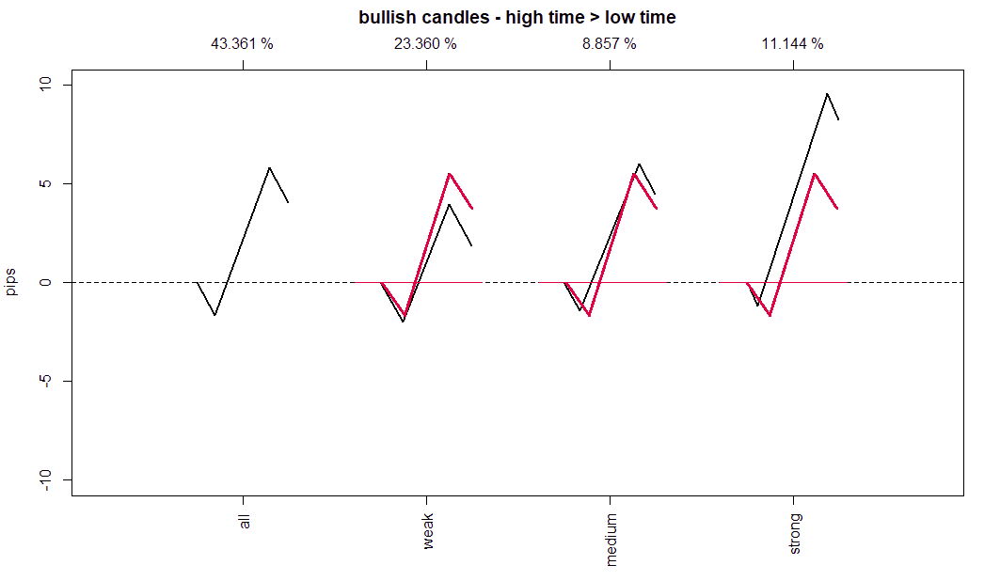

# Classifying Candles project
The attempt is to find a way to classify the **current** market situation, not to predict it. Classifying the market situation is useful in order to have an *objective* way of following it, also it gives you a map of what's probable; the paradox is that everything is possible on every moment, but still knowing what is most likely, assuming normal conditions, is certainly of help. 

Even tough this model does not predict, and it would be impossible for it to do so because of the nature of the model itself (all the statistics are collected on post-fact candlesticks), you can infer on the price current process based on the outcomes of a large sample size. 

## Project outline
| 
<nobr>Model version
 | 
Details
 |
|---------------|---------|
|[Model v.1](https://nbviewer.org/github/ironhak/test4anti/blob/main/classify_candles%20v1.ipynb) |   <ul><li>Creation of a rolling time frame based on tick charts.<li> Collected informations about High/Low time of creation<li> Created a classification system based on average and st.dev of the Open-Close distance.</ul>|
|[Model v.2](https://nbviewer.org/github/ironhak/test4anti/blob/main/classify_candles%20v2.ipynb) | <ul><li>Added wick sizes measurements.<li> Changed classification system based on the average directional candlestick, instead of using st.dev. it has been chosen the avg. wick size because it's more coherent with the whole logic.</ul>|
|[Model v.3](https://nbviewer.org/github/ironhak/test4anti/blob/main/classify_candles%20v3.ipynb) |<ul><li>It has been created a code that allows to rapidly print all the relevant statistics of a given price-frame.<li> Added statistics relative to<ul><li>% of times the given category happened on the dataset.<li>Average wick size.<li>Average wicks creation time.</ul><li>Expanded categorization based on the creation order of High/Lows.</ul> |
|[Model v.4](https://nbviewer.org/github/ironhak/test4anti/blob/main/classify_candles%20v4.ipynb) |<ul><li>*Improvements of the code*: each function has been generalized, and it can be used to create multiple instances.<li> Added statistics relative to the smaller price-frame (i.e. 25%).</ul> |
|[Model v.5](https://nbviewer.org/github/ironhak/test4anti/blob/main/classify_candles%20v5.ipynb)| <ul><li>Implemented a charting application for this whole concept: using a DC as basis and add to its midline the values found on previous statistical analysis.<li>Collected new stats about the distribution of price around categories using DC.<li>Created a method similar to MACD to display DC.</li><li>Collected stats about distribution of each scenario from the 36 possible ones.</li><li>Created a transition probability matrix about every scenario. [Download](transition_matrix.csv)</li></ul> |

## Main concepts
### 1. Implications of the Open-Close distance
The main properties of a bullish candle, that can be understood from the average bullish candle, are:
1. If you don't care about the high/low order, overall you'll see the low is built before the high.

2. In these candles the high is built around the (calculation period x 0.75)/(calculation period)th tick, i.e. ticktime-wise at about 25 % of the candlestick period before that candlestick closes bullish. 
    >*Maybe this can be called a "market constant", basically you can choose ANY price-frame size and without doing any statistics you can immediately know, on average, when a High/Low will be created in the time-axis.*
3. The wicks become shorter the stronger the candlestick's strength (close-open distance) is. 
    >*In other words: higher OC means lower drawdown of the trend/trade (always remember, these are ex-post considerations!).*
    >
    >

    >
    >The red lines are just a copy of the standard bullish candle (the one labeled with "all"), as you can see an extra-performance over the standard candle on average means lower wick sizes.

Consequence of the points above are the following considerations about the Open-Close range:
- If OC is smaller than the average candlestick's OC range (regardless of the high/low order), we can conclude that current performance is weak.
- If the candlestick closes in the area between High-Close of the average bullish candlestick (regardless its order), we know that we're in a zone that statistically an average candlestick should visit during its lifetime. Thus, it's a medium move (i.e. nothing out of the ordinary).
- If a bullish candlestick closes above the High of the average bullish candlestick (regardless of its high/low order), we know it's performing better than most bullish candlesticks.

Thus, the last 2 possibilities indicate a trend, and we could hold on to our long trade (if we're in a long position).

### 2. Insights from Random Walk theory
*According to random walk theory, any price target that is closer to a starting point will be more likely reached by the random price walk than any price target that's further away. What does that mean? It means, if the close price is above the mid-line, it is more likely that price will go above the average upper wick line before it gets below the lower average wick line. There's a certainty that price will reach a price above the average upper wick line before it will go below the average lower wick line (or, if it is already inside these "beyond wick zones") it will stay in more likely than leaving it and immediately go to the other side.*

### 3. Smaller price-frames
*To specify a trend, you have to measure the trend's strength (main oc) as well as it's counter-trend force (wick oc).*

Regardless of the Open-Close range, a counter trend can **always** start, that is why the second most important measure to look at is the High-Close distance (vice-versa for downtrends); it's basically the draw-dawn of the current trend. 

**Problem:** How do you know if the High-Close (countertrend) distance you're seeing is being created right now or if it was created too long ago, maybe at the start of the candlestick? You certainly don't want to manage a trade with informations that do not represent current situation. 

**Solution:** On previous section we understood that High will be created at 75% of the lifetime in a bullish candle, thus the remaining $25\%$ should represent the final retracement of a bullish candle. The logical choice would be to create a price-frame with a period/tick/dimension $25\%$ of the main one, that way you can measure in real-time the High-Close measure. 

- Now imagine you opened a long trade because Open-Close distance on main price-frame was relevant, you need to start looking at the smaller price-frame in order to see the counter-trend force.
- If the Open-Close range of the $25\%$ price-frame becomes smaller than the average performance of a bearish candlestick, we could think about exiting or managing/securing our long trade. 
- If it closes below the average low of that $25\%$ candlestick, we should definitively exit. Why? Because according to these findings we now have a much higher chance that this low will be expanded to the downside.

> According to the square time principle from random walk theory, if you're looking at two time frames that are in a 4:1 ratio, the average candlestick's ranges of the smaller candlestick will be 1/2 of that of the higher TF.

Indeed, there are several connections between the $1000$ ticks price-frame and the $0.25\cdot1000$ price frame, here's some data:

1000 tick dimension
<table>
<thead>
<tr><th style="text-align: right;">                           Bullish</th><th style="text-align: right;">    All</th><th style="text-align: right;">   Weak</th><th style="text-align: right;">  Medium</th><th style="text-align: right;">  Strong</th></tr>
</thead>
<tbody>
<tr><td style="text-align: right;">                           percent</td><td style="text-align: right;">    49%</td><td style="text-align: right;">    29%</td><td style="text-align: right;">      8%</td><td style="text-align: right;">     11%</td></tr>
<tr><td style="text-align: right;">                      average body</td><td style="text-align: right;">0.00046</td><td style="text-align: right;">0.00021</td><td style="text-align: right;"> 0.00056</td><td style="text-align: right;"> 0.00105</td></tr>
<tr><td style="text-align: right;">                average upper wick</td><td style="text-align: right;">0.00021</td><td style="text-align: right;">0.00024</td><td style="text-align: right;"> 0.00018</td><td style="text-align: right;"> 0.00016</td></tr>
<tr><td style="text-align: right;">                average lower wick</td><td style="text-align: right;">0.00021</td><td style="text-align: right;">0.00024</td><td style="text-align: right;"> 0.00018</td><td style="text-align: right;"> 0.00016</td></tr>
<tr><td style="text-align: right;">           average upper wick time</td><td style="text-align: right;">    729</td><td style="text-align: right;">    651</td><td style="text-align: right;">     810</td><td style="text-align: right;">     878</td></tr>
<tr><td style="text-align: right;">average upper wick time percentage</td><td style="text-align: right;">    72%</td><td style="text-align: right;">    65%</td><td style="text-align: right;">     81%</td><td style="text-align: right;">     87%</td></tr>
<tr><td style="text-align: right;">           average lower wick time</td><td style="text-align: right;">    242</td><td style="text-align: right;">    310</td><td style="text-align: right;">     165</td><td style="text-align: right;">     119</td></tr>
<tr><td style="text-align: right;">average lower wick time percentage</td><td style="text-align: right;">    24%</td><td style="text-align: right;">    31%</td><td style="text-align: right;">     16%</td><td style="text-align: right;">     11%</td></tr>
</tbody>
</table>

250 tick dimension
<table>
<thead>
<tr><th style="text-align: right;">                           Bullish</th><th style="text-align: right;">    All</th><th style="text-align: right;">   Weak</th><th style="text-align: right;">  Medium</th><th style="text-align: right;">  Strong</th></tr>
</thead>
<tbody>
<tr><td style="text-align: right;">                           percent</td><td style="text-align: right;">    49%</td><td style="text-align: right;">    30%</td><td style="text-align: right;">      7%</td><td style="text-align: right;">     11%</td></tr>
<tr><td style="text-align: right;">                      average body</td><td style="text-align: right;">0.00023</td><td style="text-align: right;">0.00011</td><td style="text-align: right;"> 0.00028</td><td style="text-align: right;"> 0.00052</td></tr>
<tr><td style="text-align: right;">                average upper wick</td><td style="text-align: right;"> 0.0001</td><td style="text-align: right;">0.00011</td><td style="text-align: right;">   8e-05</td><td style="text-align: right;">   7e-05</td></tr>
<tr><td style="text-align: right;">                average lower wick</td><td style="text-align: right;">  9e-05</td><td style="text-align: right;">0.00011</td><td style="text-align: right;">   8e-05</td><td style="text-align: right;">   7e-05</td></tr>
<tr><td style="text-align: right;">           average upper wick time</td><td style="text-align: right;">    181</td><td style="text-align: right;">    162</td><td style="text-align: right;">     200</td><td style="text-align: right;">     216</td></tr>
<tr><td style="text-align: right;">average upper wick time percentage</td><td style="text-align: right;">    72%</td><td style="text-align: right;">    65%</td><td style="text-align: right;">     80%</td><td style="text-align: right;">     86%</td></tr>
<tr><td style="text-align: right;">           average lower wick time</td><td style="text-align: right;">     57</td><td style="text-align: right;">     72</td><td style="text-align: right;">      41</td><td style="text-align: right;">      27</td></tr>
<tr><td style="text-align: right;">average lower wick time percentage</td><td style="text-align: right;">    22%</td><td style="text-align: right;">    29%</td><td style="text-align: right;">     16%</td><td style="text-align: right;">     11%</td></tr>
</tbody>
</table>

As you may see, the values expressed in % are basically the same and the values expressed in pips are almost perfectly multiples of 2. This has two main implications that I see:
1. There are "universal" properties of the markets that seems to emerge on every kind of chart, period, timeframe you look at. 
2. The 25% of a price-frame seems to produce "harmonic" proportions between higher and lower periods. 

#### $36$ combinations
It has now become clear how each trend can be subdivided in $6$ categories: weak-medium-strong for both bullish and bearish. Taking into account also the lower dimension, now we have $6^2=36$ possible configurations.

#### $6^3=216$ combinations 
You could also measure the counter-trend potential of the counter-trend, this would be the $25\%$ dimension of the lower dimension... In other words, this can introduce:
- View the possibility of price turning back in your favor during a trade which is in drawdown or that is doing a retest. 
    > Usually most of the traders just wait and hold the position hoping for a trade to stop being in drawdown and start going into their favor, others just cut the loss as soon as possible; with this measure you could *objectively* know if it's worth it to wait before closing or if it's time to get out.

- The possibility of price reverting against your trade when also the lower dimension is in our favor (price is making new highs), in other words: a fastest way to see potential reversion of price.

> This subsection tough is really more of a future idea... Mastering $36$ possible configurations should keep busy for a while. 

### 4. Insights from the transition matrix (model v.5)
- **The most probable thing the market will do in $n$ ticks from now is staying on the same conditions of the current moment.**
- Immediately more probable are configurations closer to the current one. For example, the chances of switching from Bullish-Strong / Bullish-Strong to Bearish-Strong / Bearish-strong is basically 0. 

My hypothesis is that the edge would be to use this characteristic of markets. You “collect” info about current condition (i.e. classification of 1k price frame), you collect info about lower dimension in order to see rapidly if the current condition is changing, and you profit on this tendency of the market to maintain to be "more stationary than not" in the current condition. 

It’s like arbitraging the market itself: you know that due to chaos/random/whatever conditions at point $t=A$ almost never are equal to conditions at point $t=B$, but the transition matrix proves that the path between $A$ to $B$ is full of points where the most likely state is the one immediately before. It’s like a sort of anomaly. If it was TRULY random then the probability transition matrix would have had: 
- fixed probability of 1/36 for each condition, assuming uniform random distribution.
- higher probabilities for return to the center of the channel (mean reversion), assuming a normal distribution. 

